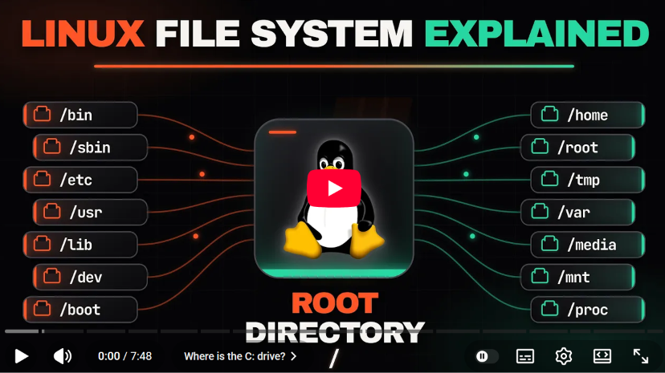

# Lab Manual on Distributed Databases: Replication, Failover, and Durability with PostgreSQL

**Course:** Advanced Database Systems\
**Level:** Master's\
**Database Management System:** PostgreSQL 18 (a 3-node cluster: 1 primary + 2 replicas)\
**Platform:** Docker\
**Recommended duration:** 3-4 hours\
**Mode:** Individual\
**Prerequisite:** Module 1 (Lab on Database Transactions and Recovery)

------------------------------------------------------------------------

## 1. Purpose of the lab

Module 1 taught you how PostgreSQL behaves inside a *single* node. This
laboratory asks the next question: what changes once there is more than
one node, and those nodes must coordinate over a network that can be
slow, or can simply fail?

You will build and operate a real three-node PostgreSQL cluster: one
primary and two replicas, using streaming replication, and you will
deliberately break it in controlled ways:

- slow it down with synchronous replication
- starve it of the acknowledgements it needs
- fail it over manually
- force it into split-brain
- crash it mid-write and see what does, and does not, survive

Every mechanic in this laboratory maps directly onto one or both of your
two case studies:

The lab prepares you for two incident-report case studies:

- [GitHub](incident/03_distributed_failover_github2012.md): automated failover made an
  outage worse, not better.
- [Razorpay](incident/04_distributed_replication_razorpay.md): an RDS Multi-AZ failover was followed by
  roughly five seconds of missing payment data.

The learning sequence is:

``` text
Lecture concept
      ↓
Controlled PostgreSQL experiment
      ↓
Observation
      ↓
Explanation
      ↓
Production incident
      ↓
Diagnosis and remediation
```

The most important rule throughout this lab is:

> **Do not report only what happened. Explain *why* it happened.**

------------------------------------------------------------------------

## 2. Learning outcomes

By the end of this laboratory, you should be able to:

- build and verify a streaming-replication PostgreSQL cluster;
- distinguish asynchronous from synchronous replication by observing,
    not just describing, the difference;
- explain `sync_state` values (`async`, `sync`, `quorum`, `potential`)
    from direct evidence in `pg_stat_replication`;
- apply the W + R > RF quorum rule to a real two-replica configuration
    and predict, correctly, when a write will block;
- perform a manual failover using `pg_promote()`;
- explain, from a scenario you built yourself, what split-brain is and
    why an automated failover mechanism must guard against it;
- distinguish "the client received a commit confirmation" from "the
    data is durable," using a live PostgreSQL cluster to demonstrate the
    difference precisely;
- connect specific, named PostgreSQL mechanisms to specific moments in
    both incident case studies;
- use cluster evidence (`pg_stat_replication`, `pg_stat_activity`,
    `wait_event`) to investigate a distributed-database incident, the
    same way you used `pg_locks` and `pg_stat_activity` in Module 1.

------------------------------------------------------------------------

## 3. Important rules before starting

### Rule 1 — Do not skip the observation questions

Exactly as in Module 1: the questions are part of the laboratory. They
force you to connect the command you executed to the mechanism behind
it.

### Rule 2 — This lab intentionally breaks the cluster. That is the point.

You will stop nodes, promote replicas, and crash the primary on purpose.
Several exercises are only meaningful because something goes wrong. Do
not treat an error message or a hanging command as a sign that you did
something incorrectly — read the instructions carefully; a hang is
frequently the *expected result*.

### Rule 3 — Keep track of which port is which node

You will have psql sessions open to three different nodes at once. Label
your terminals:

``` text
PRIMARY   -> localhost:5441
REPLICA 1 -> localhost:5442
REPLICA 2 -> localhost:5443
```

Running a command against the wrong node is the most common
source of confusion in this laboratory.

### Rule 4 — If the cluster ends up in a state you cannot make sense of

Run:

``` bash
chmod u+x reset_lab.sh
sed -i 's/\r$//' reset_lab.sh
./reset_lab.sh
```

This destroys all data and rebuilds a clean primary + two replicas. It
is normal to need this once or twice during the laboratory — several
parts deliberately leave the cluster in a "broken" state that only the
next part, or a reset, resolves.

------------------------------------------------------------------------

## 4. Software requirements

You need:

- Docker Desktop on Windows or macOS, or Docker Engine + Docker
    Compose on Linux;
- a terminal, ideally able to open at least three tabs or panes at
    once;
- Module 1 completed, or equivalent familiarity with `BEGIN`,
    `COMMIT`, `ROLLBACK`, and `pg_stat_activity`.

You **do not** need to install PostgreSQL directly on your computer.

------------------------------------------------------------------------

## 5. Understanding the laboratory environment

``` text
Your computer
     |
     | Docker
     v
+----------------------------------------------------------------+
|                     labnet (Docker network)                    |
|                                                                |
|   +----------------+      streams WAL     +----------------+   |
|   |  pg-primary    | -------------------> |  pg-replica1   |   |
|   | (writable)     |                      | (read-only)    |   |
|   | host:5441      |                      | host:5442      |   |
|   |                |                      +----------------+   |
|   |                | -------------------> |  pg-replica2   |   |
|   +----------------+      streams WAL     | (read-only)    |   |
|                                           | host:5443      |   |
|                                           +----------------+   |
+----------------------------------------------------------------+
```

Each replica was built by taking a real base backup of the primary
(`pg_basebackup`) and configuring it to continuously stream the
primary's Write-Ahead Log (WAL) — the same mechanism you saw a single
node write to itself in Module 1's WAL/crash-recovery theory material, now sent
across the network to another node.

The database contains one main table for the exercises, plus one you
will use to make split-brain and failover visible:

### `accounts`

```text
account_id   account_name     balance
------------ -------------- ---------
            1 Account A        1000.00
            2 Account B        1000.00
```

### `transaction_log`

Records which **node** performed a write, and when. In Part F you will
use this table to make split-brain undeniable: after a failover, two
nodes can each insert a row the other one never receives.

### `node_status` (a view, not a table)

A one-line answer to "which node is this, and can it currently accept
writes?" Query it any time you are unsure:

``` sql
SELECT * FROM node_status;
```

### A Shell
A shell is **a command-line interpreter that provides a user interface for interacting with an Operating System.** Different shells offer different syntax, features, scripting capabilities, and user experiences.

There are different types of shells. For example:

- Bourne Shell (sh)
- Bourne Again Shell (Bash)
- C Shell (csh)
- Korn Shell (ksh)
- Z Shell (zsh)
- Fish Shell (fish)
- PowerShell

We use `Git Bash` in our labs which is a terminal that runs on Windows and allow us to access the Bourne Again Shell (Bash).

### Difference between a Terminal and a Shell

- A terminal is a program that runs on your computer and allows you to interact with it via a command line interface (CLI).

- The shell is the program that interprets the commands you type in the terminal.

### Tutorials on Shell Scripting


**Shell scripting** is the process of writing shell scripts that can be executed by the shell. It allows you to automate tasks, manage system operations, and perform various functions on your computer.

It is an essential skill for **System Administrators**.

The following site provides a tutorial on shell scripting: [https://www.tutorialspoint.com/unix/shell_scripting.htm](https://www.tutorialspoint.com/unix/shell_scripting.htm)

This lab uses the `Bourne Again Shell` (Bash) as indicated at the top of each Shell script (each `.sh` file): `#!/bin/bash`. You can read more about Bash scripting here: [https://www.gnu.org/software/bash/](https://www.gnu.org/software/bash/)

#### Explanation of Linux File System

[](https://youtu.be/qvjRcZcW8CY)

Link: [https://youtu.be/qvjRcZcW8CY](https://youtu.be/qvjRcZcW8CY)  
Source: **Cloud X Berry**

### Explanation of Linux File Permissions


------------------------------------------------------------------------

## 6. SETUP

## Step 1 --- Open a terminal

Open a terminal in the directory containing this laboratory's
`docker-compose.yaml`.

Check Docker:

``` bash
docker --version
docker compose version
```

## Step 2 --- Check the Docker Compose configuration

``` bash
docker compose config
```

### Expected result

Docker Compose displays the resolved configuration with no error.

## Step 3 --- Start the cluster

``` bash
docker compose up -d
docker compose ps
```

### Expected result

Three services. All three should eventually show `healthy`.

### Why do the replicas take longer than the primary — and why does replica2 take longer still?

Each replica's very first start performs a genuine `pg_basebackup`
against the primary — copying its entire data directory over the
network — before it can start as a standby. This is real replication
setup work, not a fixed delay.

`pg-replica2` is deliberately configured to wait until `pg-replica1` is
already healthy before it even begins its own base backup. Two base
backups running against the primary at the exact same instant compete
for the same checkpoint and WAL-retention window, which can (rarely,
but reproducibly) cause the primary to recycle a WAL segment one of
the backups still needs. Serializing the two removes that race
entirely, at the cost of replica2 visibly starting later. This is
expected, not a fault: watch it happen with:

``` bash
docker compose logs -f pg-replica1
```

Press `Ctrl+C` to stop following the logs once you see
`database system is ready to accept read-only connections`.

## Step 4 — Verify with the automated check

``` bash
chmod u+x verify_lab.sh
sed -i 's/\r$//' verify_lab.sh
./verify_lab.sh
```

### Expected result

The script reports node roles, `pg_stat_replication` status for both
replicas, and confirms a write on the primary reaches both replicas. It
ends with `SUCCESS`.

If it does not succeed, see **Part K — Troubleshooting** before
continuing.

------------------------------------------------------------------------

# PART A — ORIENTATION: THREE NODES, ONE CLUSTER

## Objective

Confirm you can find, and tell apart, all three nodes before doing
anything to them.

## Step A1 — Connect to each node in its own terminal

Terminal 1:

``` bash
docker compose exec pg-primary psql -U lab_user -d distributed_lab
```

Terminal 2:

``` bash
docker compose exec pg-replica1 psql -U lab_user -d distributed_lab
```

Terminal 3:

``` bash
docker compose exec pg-replica2 psql -U lab_user -d distributed_lab
```

Label each terminal PRIMARY, REPLICA 1, REPLICA 2 and keep all three
open for the rest of the laboratory.

## Step A2 — Ask each node who it is

In **all three** terminals, run:

``` sql
SELECT * FROM node_status;
```

### Expected observation

The primary reports `PRIMARY (read-write)`. Both replicas report
`REPLICA (read-only)`.

### Important — read this carefully

`node_status` is a **view**. It was created once, on the primary, in
Part 02 of the setup scripts. You did not need to create it again on
either replica — it arrived there automatically, the same way any other
committed change arrives, because DDL (schema changes) replicate exactly
like data changes. This is worth pausing on: everything you will see
propagate in this laboratory, structure and data alike, travels through
the identical WAL-streaming mechanism.

## Step A3 — Confirm a replica genuinely refuses writes

In the **REPLICA 1** terminal:

``` sql
UPDATE accounts SET balance = balance + 1 WHERE account_id = 1;
```

### Expected result

``` text
ERROR:  cannot execute UPDATE in a read-only transaction
```

### Why?

A replica is not "a database that happens not to receive writes right
now" — it actively refuses them. This is a real, enforced constraint,
not a convention your application must remember to honour.

## Step A4 — See the replicas from the primary's point of view

In the **PRIMARY** terminal:

``` sql
SELECT application_name, state, sync_state, replay_lsn
FROM pg_stat_replication
ORDER BY application_name;
```

### Expected observation

Two rows, `replica1` and `replica2`, both `state = streaming` and
`sync_state = async`.

### Why?

`pg_stat_replication` is the primary's own live account of every replica
currently connected to it. `application_name` is how each replica
identifies itself — it is not guessed from the network connection, it is
a name the replica supplied when it connected (you will rely on this
fact directly in Part C and Part D).

------------------------------------------------------------------------

## Concept checkpoint

1.  What is the difference between a replica refusing a write and a
    replica simply being slow to respond to one?
2.  Why does a *view* propagate to a replica the same way *data* does?
3.  What information does `pg_stat_replication` give you that
    `pg_stat_activity` (from Module 1) does not?

------------------------------------------------------------------------

# PART B — ASYNCHRONOUS REPLICATION

## Objective

Observe the default replication mode, and see precisely what
"eventually consistent" means for a concrete write.

## Step B1 — Write on the primary

In the **PRIMARY** terminal:

``` sql
INSERT INTO transaction_log (node_name, description)
VALUES ('pg-primary', 'Part B: asynchronous replication test');
```

### Expected result

``` text
INSERT 0 1
```

Note that this returned immediately.

## Step B2 — Check both replicas right away

Switch **immediately** to **REPLICA 1** and **REPLICA 2**:

``` sql
SELECT * FROM transaction_log ORDER BY log_id DESC LIMIT 1;
```

### Expected observation

On a local Docker network, the row is very likely already there — the
replication lag is typically a few milliseconds. This is worth noting
precisely: **asynchronous does not mean slow**; it means *not
guaranteed*, which is a different property from *fast* or *slow*.

## Step B3 — Make the lag visible on purpose

Reconnect from the primary is not required — instead, measure it
directly. In the **PRIMARY** terminal:

``` sql
SELECT pg_current_wal_lsn();
```

Note the value. In **REPLICA 1**:

``` sql
SELECT pg_last_wal_replay_lsn();
```

### Expected observation

The replica's replay position is at or extremely close to the primary's
current position. If you run the primary's query again after a write,
then immediately the replica's query, you may catch the replica a few
bytes behind — that gap is the lag, made visible as a difference in log
sequence numbers rather than a difference in wall-clock time.

### Why does this matter?

> The primary returned `INSERT 0 1` to the client the instant it wrote
> its own WAL — it did **not** wait for either replica to confirm
> anything.

This is the mechanism, not an approximation of it. Hold this result in
mind for Part C, where you will change exactly one setting and watch
this same `INSERT` behave completely differently.

------------------------------------------------------------------------

## Concept checkpoint

4.  In your own words, what does "eventually consistent" mean, now that
    you have watched it happen rather than only read the definition?
5.  Why might a `SELECT` issued against a replica milliseconds after a
    primary write sometimes return stale data, and sometimes not?
6.  Which PACELC branch (Else → Latency vs. Consistency, from the
    lecture) does asynchronous replication choose?

------------------------------------------------------------------------

# PART C — SYNCHRONOUS REPLICATION AND THE COST OF WAITING

## Objective

Force the primary to wait for a specific replica's acknowledgement
before confirming a write, then remove that replica and watch the write
hang.

## Step C1 — Make replica1 the synchronous standby

In the **PRIMARY** terminal:

``` sql
ALTER SYSTEM SET synchronous_standby_names = 'replica1';
SELECT pg_reload_conf();
```

### Why `pg_reload_conf()` and not a restart?

`synchronous_standby_names` takes effect on a configuration **reload**,
not a restart. This is worth contrasting explicitly with Module 1's
`wal_level`, which is a *postmaster*-context setting that only takes
effect after a full restart. Not every configuration change carries the
same cost — knowing which category a setting falls into is itself an
operational skill.

## Step C2 — Confirm the change

``` sql
SELECT application_name, sync_state FROM pg_stat_replication ORDER BY application_name;
```

### Expected observation

``` text
 application_name | sync_state 
-------------------+------------
 replica1          | sync
 replica2          | async
```

`replica1`'s `application_name` — set when it connected — is exactly
what `synchronous_standby_names` matched against. If you had misspelled
it, PostgreSQL would not have raised an error; it would simply never
find a matching standby, and every write would hang forever. This is a
real, easy-to-make production mistake, worth remembering.

## Step C3 — Confirm a normal write is still fast

``` sql
UPDATE accounts SET balance = balance - 10 WHERE account_id = 1;
```

### Expected result

Fast — replica1 is up and acknowledging.

## Step C4 — Stop the synchronous standby

**From your host terminal** (not inside any psql session):

``` bash
docker compose stop pg-replica1
```

## Step C5 — Attempt another write

Back in the **PRIMARY** psql terminal:

``` sql
UPDATE accounts SET balance = balance - 5 WHERE account_id = 1;
```

### Expected observation

**The command hangs.** It does not return, does not error, and does not
time out on its own. This is the expected, correct result — do not
assume something is broken.

While it hangs, open a **fourth** terminal and inspect it from the
outside:

``` bash
docker compose exec pg-primary psql -U lab_user -d distributed_lab -c \
  "SELECT pid, state, wait_event_type, wait_event, query FROM pg_stat_activity WHERE state != 'idle' AND query LIKE 'UPDATE%';"
```

### Expected observation

`wait_event_type = IPC`, `wait_event = SyncRep`. PostgreSQL names this
wait state explicitly — you are looking at direct evidence, not an
inference, that this specific backend is blocked waiting for
synchronous replication acknowledgement.

## Step C6 — An important, precise detail: is the change visible yet?

While the UPDATE from Step C5 is still hanging, open a **fifth**
terminal and query the primary directly:

``` bash
docker compose exec pg-primary psql -U lab_user -d distributed_lab -c \
  "SELECT * FROM accounts WHERE account_id = 1;"
```

### Expected observation

The balance still shows the **old** value — the pending `-5` change is
**not yet visible**, even to a separate session querying the primary
directly.

### Why this matters

It would be a reasonable guess that the data is "already there, just
not confirmed to the client yet." That guess is wrong, and it matters:
the synchronous wait blocks *visibility*, not merely the *client's
confirmation message*. Until a synchronous standby acknowledges,
PostgreSQL has not yet made the transaction's effects visible to
anyone — including other sessions on the primary itself.

## Step C7 — Recover

``` bash
docker compose start pg-replica1
```

Return to the **PRIMARY** psql terminal. The hung `UPDATE` from Step C5
should now complete on its own.

``` sql
SELECT application_name, sync_state FROM pg_stat_replication ORDER BY application_name;
```

Confirm both replicas are streaming again before continuing.

------------------------------------------------------------------------

## Concept checkpoint

7.  Complete this sentence: "Synchronous replication trades \_\_\_\_\_\_\_\_\_\_
    for \_\_\_\_\_\_\_\_\_\_."
8.  Why did the `UPDATE` in Step C5 neither succeed nor produce an
    error message?
9.  Why is it significant that the pending change was invisible even to
    another session on the *primary itself*?
10. If you had misspelled `synchronous_standby_names = 'repilca1'` in
    Step C1, what would you have observed in Step C3, and would
    PostgreSQL have told you anything was wrong?

------------------------------------------------------------------------

# PART D — QUORUM COMMIT ACROSS TWO REPLICAS

## Objective

Apply the W + R > RF rule from the lecture to a live, two-replica
configuration, and predict — correctly — when a write will and will not
block.

## Step D1 — Switch to quorum commit

In the **PRIMARY** terminal:

``` sql
ALTER SYSTEM SET synchronous_standby_names = 'ANY 1 (replica1, replica2)';
SELECT pg_reload_conf();

SELECT application_name, sync_state FROM pg_stat_replication ORDER BY application_name;
```

### Expected observation

Both replicas now show `sync_state = quorum` — a third value, distinct
from both `async` and the priority-based `sync` you saw in Part C.
`ANY 1 (replica1, replica2)` means: *any one* of these two acknowledging
is sufficient. This is exactly the quorum arithmetic from the lecture,
with RF = 2 (two replicas), and a write quorum requirement of 1.

## Step D2 — Predict, then test: stop ONE replica

**Before running the next command, write down your prediction:** will a
write hang, or succeed quickly?

``` bash
docker compose stop pg-replica1
```

Back in the **PRIMARY** terminal:

``` sql
UPDATE accounts SET balance = balance - 1 WHERE account_id = 2;
```

### Expected observation

Succeeds quickly. `replica2` alone satisfies "any 1 of 2."

## Step D3 — Predict, then test: stop the SECOND replica too

**Predict again before running this:**

``` bash
docker compose stop pg-replica2
```

``` sql
UPDATE accounts SET balance = balance - 1 WHERE account_id = 2;
```

### Expected observation

**Hangs.** With zero replicas up, "any 1 of 2" cannot be satisfied by
anyone.

## Step D4 — Recover

``` bash
docker compose start pg-replica1
docker compose start pg-replica2
```

Confirm the hung write from Step D3 completes, and that both replicas
show `sync_state = quorum` again.

## Step D5 — Contrast quorum with priority (optional, recommended)

Re-run Part C's Step C1 (`synchronous_standby_names = 'replica1'`) and
repeat Step D2's test — stop **replica2** this time, leaving replica1
up.

### Expected observation

The write still succeeds quickly, because `replica1` specifically (not
"any standby") is the one being waited on, and it is still up. Now stop
**replica1** instead, leaving replica2 up, and try again.

### Expected observation

**Hangs** — even though a healthy replica (replica2) exists — because
priority mode waits for the *named* standby specifically, not for
*any* standby.

### Why this contrast matters

This is the practical difference between "FIRST/priority" semantics and
"ANY/quorum" semantics, and it is precisely the design decision a real
system must make: do you want a specific, known-good replica to be your
durability guarantee, or are you content with any one of a pool?
Different production systems make this trade-off differently, and
neither choice is unconditionally correct.

Return `synchronous_standby_names` to quorum mode before continuing:

``` sql
ALTER SYSTEM SET synchronous_standby_names = 'ANY 1 (replica1, replica2)';
SELECT pg_reload_conf();
```

------------------------------------------------------------------------

## Concept checkpoint

11. With RF = 2 and a write quorum of 1, what is the minimum number of
    replicas that must be reachable for a write to succeed?
12. If this cluster instead used `ANY 2 (replica1, replica2)`, how many
    replicas would need to be down before a write hangs?
13. Explain, using this exercise as your evidence, the practical
    difference between `synchronous_standby_names = 'replica1'` and
    `synchronous_standby_names = 'ANY 1 (replica1, replica2)'`.
14. Connect this exercise to the W + R > RF rule from the lecture. What
    is W here? What would R need to be for this configuration to
    guarantee a reader always sees the latest write?

------------------------------------------------------------------------

# PART E — MANUAL FAILOVER

## Objective

Promote a replica to a writable primary, using the same underlying
mechanism a real automated failover tool would use — just performed by
hand, so every step is visible.

## Step E1 — Reset synchronous replication before this exercise

In the **PRIMARY** terminal:

``` sql
ALTER SYSTEM SET synchronous_standby_names = '';
SELECT pg_reload_conf();
```

(This avoids one node's promotion getting tangled up with another node's
synchronous-wait state, which is not the focus of this Part.)

## Step E2 — Confirm replica1's current role

In the **REPLICA 1** terminal:

``` sql
SELECT * FROM node_status;
```

Should show `REPLICA (read-only)`.

## Step E3 — Promote it

Still in **REPLICA 1**:

``` sql
SELECT pg_promote();
```

### Expected result

``` text
 pg_promote 
------------
 t
```

Wait two or three seconds, then:

``` sql
SELECT * FROM node_status;
```

### Expected observation

`PRIMARY (read-write)`. Confirm it by actually writing:

``` sql
UPDATE accounts SET balance = balance + 500 WHERE account_id = 1;
SELECT * FROM accounts ORDER BY account_id;
```

### Why this matters

`pg_promote()` is a single SQL function call. This is deliberately
anticlimactic: the mechanism itself is simple. What makes failover hard
in practice is everything *around* this call — deciding *when* to call
it, and dealing with what the *old* primary does next. That is exactly
what Part F is about.

------------------------------------------------------------------------

## Concept checkpoint

15. What had to be true about replica1's data, before promotion, for
    `pg_promote()` to be safe to call?
16. Why does this laboratory deliberately separate "promoting a
    replica" (a simple, fast operation) from "deciding when to
    promote" (the hard part, which Part F and the GitHub case study
    both examine)?

------------------------------------------------------------------------

# PART F — SPLIT-BRAIN: WHAT FAILOVER DOES NOT AUTOMATICALLY PREVENT

## Objective

You just promoted replica1. The original primary is still running. Watch
what happens when both are allowed to accept writes at once.

## Step F1 — Confirm the old primary is still alive and writable

Switch to your original **PRIMARY** terminal (port 5441 — do not close
this session; it is exactly what makes this exercise possible).

``` sql
SELECT * FROM node_status;
```

### Expected observation

Still says `PRIMARY (read-write)`. **Nothing has told this node it was
replaced.** In a real automated-failover system, a well-designed
mechanism would fence this node off (stop it, or block its writes)
before or immediately after promoting a replacement. This laboratory
deliberately skips that step so you can see why it is necessary.

## Step F2 — Write to the OLD primary

Still in the original **PRIMARY** terminal:

``` sql
INSERT INTO transaction_log (node_name, description)
VALUES ('pg-primary (OLD - still running)', 'Write accepted after failover. This node does not know it was replaced.');
```

## Step F3 — Write to the NEW primary

In the **REPLICA 1** terminal (now promoted):

``` sql
INSERT INTO transaction_log (node_name, description)
VALUES ('replica1 (NEWLY PROMOTED)', 'Write accepted as the new primary after failover.');
```

## Step F4 — Compare

**Old primary** terminal:

``` sql
SELECT log_id, node_name, description FROM transaction_log ORDER BY log_id;
```

**New primary (replica1)** terminal:

``` sql
SELECT log_id, node_name, description FROM transaction_log ORDER BY log_id;
```

### Expected observation

Both nodes now show a row with the **same `log_id`** but **different
content**. Two independent, equally "valid," permanently diverging
histories — created safely, in a lab environment.

### Why this is split-brain, precisely

Neither node is malfunctioning. Neither query returned an error. Each
node correctly and faithfully recorded a write it was told to accept.
The problem is not a broken component — it is the **absence of
agreement** about which node is allowed to be "the" primary. This is
exactly the situation the GitHub case study's Section 4 describes as "a
partition in the cluster" in which "different nodes did not always have
a consistent view of cluster state."

## Step F5 — Recover

This cluster cannot be safely un-split by hand — that is the point.
Reset it:

``` bash
chmod u+x reset_lab.sh
sed -i 's/\r$//' reset_lab.sh
./reset_lab.sh
```

------------------------------------------------------------------------

## Concept checkpoint

17. In your own words, what is split-brain? Do not define it
    abstractly — describe what you specifically observed in Step F4.
18. What single step, inserted between "promote replica1" (Part E) and
    "allow either node to accept writes" (this Part), would have
    prevented split-brain here?
19. Re-read Case 3 (GitHub), Section 4 ("A second complication: cluster
    partition"). Which of your own steps in this Part corresponds to
    "different nodes did not always have a consistent view of cluster
    state"?
20. Why is it not enough for an automated failover tool to be good at
    *promoting* a replica (Part E showed this is the easy part)? What
    else must such a tool get right?

------------------------------------------------------------------------

# PART G — THE DURABILITY WINDOW: WHAT "COMMITTED" ACTUALLY SURVIVES

## Objective

Test, directly, the gap between "the client received a commit
confirmation" and "the data is durable" — the exact question at the
centre of the Razorpay case study.

## Before you start: make a prediction

`synchronous_commit` controls whether PostgreSQL waits for the WAL
record to be flushed to disk before confirming a commit to the client.
Setting it to `off` returns control to the client faster, at the cost of
a window in which a recently "committed" transaction is not yet
guaranteed durable.

**Write down your prediction now:** if you turn `synchronous_commit`
off, commit a transaction, and immediately kill the primary's process
outright — not a graceful stop, a hard kill — do you expect the
transaction to survive, or be lost?

## Step G1 — Turn off synchronous commit

In the **PRIMARY** terminal:

``` sql
ALTER SYSTEM SET synchronous_commit = off;
SELECT pg_reload_conf();
SHOW synchronous_commit;
```

## Step G2 — Commit a clearly identifiable transaction

``` sql
INSERT INTO transaction_log (node_name, description)
VALUES ('pg-primary', 'DURABILITY TEST ROW -- survives a hard kill?');
```

### Expected result

Returns immediately — faster than Part C's synchronous writes, and
without waiting for any replica either.

## Step G3 — Immediately, from your host terminal, kill the primary outright

``` bash
docker kill mod2_pg_primary
```

`docker kill` sends `SIGKILL` by default — the container's PostgreSQL
process is terminated with no opportunity to run its own shutdown
sequence. This is a deliberately harsher event than `docker compose
stop`, which asks PostgreSQL to shut down gracefully. `SIGKILL`
approximates the process simply ceasing to exist, mid-operation,
without warning.

## Step G4 — Bring it back

``` bash
docker compose start pg-primary
docker compose logs pg-primary --tail=30
```

Watch the log. You should see PostgreSQL detect it "was not properly
shut down" and perform automatic crash recovery by replaying WAL — the
exact mechanism from Module 1's recovery material, now triggered for
real.

## Step G5 — Check whether the row survived

``` bash
docker compose exec pg-primary psql -U lab_user -d distributed_lab -c \
  "SELECT log_id, node_name, description FROM transaction_log ORDER BY log_id DESC LIMIT 3;"
```

### Expected observation — read this carefully, it may surprise you

**The row is very likely still there.**

If your prediction was "it will be lost," you predicted the commonly
assumed answer — and the commonly assumed answer is not quite right.
Here is why, precisely:

`synchronous_commit = off` does not stop PostgreSQL from *writing* the
WAL record. It only skips the `fsync()` call that would force the
operating system to guarantee that write has reached physical storage
before confirming the commit. In practice, PostgreSQL's backend (or the
background WAL writer, shortly afterward) still issues an ordinary
`write()` of that WAL record into the **operating system's page
cache** — and because Docker containers on the same machine share the
**same running Linux kernel** as the host, that page cache is not part
of the container's process state. `docker kill` terminates the
PostgreSQL *process*. It does not touch the kernel, and it does not
touch the kernel's page cache. On restart, PostgreSQL's own crash
recovery reads the WAL from disk (by way of that same page cache) and
replays it — recovering a transaction that had, in fact, already made it
past the point this experiment could destroy.

### What `synchronous_commit = off` actually protects you from, and does not

The real risk window this setting creates is a failure that also
destroys the **operating system's page cache** — a full **power loss**,
a **kernel panic**, or a **host machine crash** — not merely the death
of the PostgreSQL process while the underlying machine keeps running.
This is a materially different, and much rarer, event than a process
crash.

### Why this correction matters for the Razorpay case

Re-read Case 4, Section 4 ("The configuration clue"). The incident was
not "someone `kill -9`'d a MySQL process." It involved a **Multi-AZ
failover** — the *entire primary instance*, running on different
physical infrastructure, was replaced. That is categorically closer to
"the machine holding the page cache is now gone" than to "the database
process on an otherwise-intact machine died." This laboratory's own
result — that a mere process kill usually does *not* lose data — should
sharpen your reading of the case, not contradict it: it tells you
precisely *how severe* an event has to be before `innodb_flush_log_at_trx_commit`
(MySQL's equivalent setting) actually matters, which is exactly the
question the Razorpay engineers had to answer under pressure.

## Step G6 — Restore the default

``` sql
ALTER SYSTEM SET synchronous_commit = on;
SELECT pg_reload_conf();
```

------------------------------------------------------------------------

## Concept checkpoint

21. State, precisely, the difference between "the WAL record was
    written" and "the WAL record was fsynced."
22. Why did `docker kill` (killing the PostgreSQL process) not
    reproduce the kind of loss `synchronous_commit = off` is warning
    you about?
23. What kind of failure *would* be severe enough to actually lose an
    unflushed, asynchronously-committed transaction?
24. Re-read Razorpay Case 4's distinction between "a transaction having
    reached the database process," "having been logged," "having been
    durably flushed," and "being present on the standby that will
    become primary" (Section 4). Map each of those four stages onto
    what you just tested in this Part.
25. Was your prediction at the start of this Part correct? If not,
    what assumption led you astray?

------------------------------------------------------------------------

# PART H — MONITORING QUICK REFERENCE

Keep this page open for the remainder of the laboratory and for the
case-study discussion.

## Replica status, from the primary

``` sql
SELECT application_name, state, sync_state, replay_lsn
FROM pg_stat_replication
ORDER BY application_name;
```

## Which node am I on?

``` sql
SELECT * FROM node_status;
```

## Is a backend waiting on synchronous replication right now?

``` sql
SELECT pid, state, wait_event_type, wait_event, query
FROM pg_stat_activity
WHERE wait_event_type = 'IPC' AND wait_event = 'SyncRep';
```

## How far behind is this replica? (run ON a replica)

``` sql
SELECT now() - pg_last_xact_replay_timestamp() AS replication_delay;
```

## What is this node's current WAL position?

On the primary:

``` sql
SELECT pg_current_wal_lsn();
```

On a replica:

``` sql
SELECT pg_last_wal_replay_lsn();
```

------------------------------------------------------------------------

# PART I — BRIDGING TO THE CASE STUDIES

Work through both case studies again now, with the cluster still
available so you can re-run any exercise a question raises.

## Case 3 — GitHub, September 2012

1.  In Part D you saw quorum-based synchronous replication tolerate one
    replica's failure without blocking. GitHub's case describes health
    checks failing under *load*, not under a clean node failure. Why is
    a health check that only detects "is this node reachable" not
    sufficient to prevent the feedback loop described in Case 3, Section
    3?
2.  In Part F you produced split-brain safely because nothing fenced the
    old primary. Design, in one paragraph, the fencing step GitHub's
    2012 tooling was missing.
3.  In Part E, promotion itself was fast and simple. Case 3's incident
    was made worse by the *newly promoted node's cold cache* (Section
    3). Why does this laboratory's Part E not reproduce that specific
    problem, and what would you need to add to this cluster to
    demonstrate it?

## Case 4 — Razorpay

4.  Using your corrected understanding from Part G, explain precisely
    why "the application recovered in about two minutes" (Case 4,
    Section 2) does not mean the incident was over.
5.  Part D's quorum mechanism (`ANY 1 (replica1, replica2)`) guarantees
    a write is acknowledged by at least one replica before the client is
    told it succeeded. If Razorpay's production standby had been
    configured this way instead of relying on `innodb_flush_log_at_trx_commit`
    alone, would the five-second data-loss window in Case 4 still have
    been possible? Justify your answer using what you observed in Part
    C and Part D.
6.  Case 4 distinguishes RPO (how much data you can afford to lose) from
    RTO (how long you can be down). Using Parts E through G, give one
    concrete configuration decision from this laboratory that primarily
    affects RPO, and one that primarily affects RTO.

------------------------------------------------------------------------

# PART J — KNOWLEDGE CHECK

Answer without re-running the cluster where possible; use it only to
verify an answer you are unsure of.

1.  What is the practical difference between `async`, `sync`, and
    `quorum` as values of `sync_state` in `pg_stat_replication`?
2.  State the W + R > RF rule and apply it to Part D's configuration.
3.  What does `wait_event = SyncRep` tell you that `wait_event = Lock`
    (from Module 1) would not?
4.  Why is `pg_promote()` described in this laboratory as "the easy
    part" of failover?
5.  Define split-brain using evidence from your own Part F transcript,
    not from memory of the lecture definition.
6.  Explain the difference between a WAL record being written and being
    flushed, and why that difference only matters under specific kinds
    of failure.
7.  Why does a Docker container sharing the host's kernel matter to the
    result you observed in Part G?
8.  A colleague argues: "we don't need synchronous replication, because
    our replicas are almost never more than a few milliseconds behind."
    Using Part B and Part C as evidence, explain what is wrong with
    "almost never" as a justification for skipping synchronous
    replication in a system that cannot tolerate any data loss.
9.  Using both case studies, explain why "the system is available
    again" and "the incident is resolved" are not the same claim.
10. If you were designing a fencing mechanism to prevent the situation
    you created in Part F, what is the minimum information a node would
    need before it could safely conclude "I am allowed to accept
    writes right now"?

------------------------------------------------------------------------

# PART K — TROUBLESHOOTING

## Problem 1 — A replica never becomes healthy

``` bash
docker compose logs pg-replica1 --tail=100
```

Look for the base backup step failing. Common cause: the primary was
not yet healthy when the replica started trying to connect. Run:

``` bash
chmod u+x reset_lab.sh
sed -i 's/\r$//' reset_lab.sh
./reset_lab.sh
```

which waits for the primary before starting the replicas.

## Problem 2 — A write hangs and you did not expect it to

Check what `synchronous_standby_names` is currently set to — a setting
from an earlier Part may still be in effect:

``` bash
docker compose exec pg-primary psql -U lab_user -d distributed_lab -c "SHOW synchronous_standby_names;"
```

Check which replicas are actually running:

``` bash
docker compose ps
```

## Problem 3 — You are not sure which node is currently the primary

``` bash
for c in mod2_pg_primary mod2_pg_replica1 mod2_pg_replica2; do
  echo "--- $c ---"
  docker exec "$c" psql -U lab_user -d distributed_lab -c "SELECT * FROM node_status;"
done
```

## Problem 4 — The cluster is in a state you cannot make sense of

This is expected at least once in this laboratory, most likely after
Part F.

``` bash
chmod u+x reset_lab.sh
sed -i 's/\r$//' reset_lab.sh
./reset_lab.sh
```

## Problem 5 — Port 5441 / 5442 / 5443 is already in use

Another application on your machine is using one of these ports. Ask
your lecturer before changing the mapped host ports in
`docker-compose.yaml`; if you do change them, only change the **left**
side of each `"HOST:5432"` mapping.

------------------------------------------------------------------------

# PART L — RESET AND TEARDOWN

## Option 1 — Stop but preserve data

``` bash
docker compose down
```

## Option 2 — Full reset (used throughout this laboratory)

``` bash
chmod u+x reset_lab.sh
sed -i 's/\r$//' reset_lab.sh
./reset_lab.sh
```

## Before you leave

``` bash
docker compose ps
```

If you are finished for the day:

``` bash
docker compose down
```

------------------------------------------------------------------------

# APPENDIX — Useful commands

## Cluster lifecycle

``` bash
docker compose up -d
docker compose ps
docker compose logs -f pg-primary
docker compose stop pg-replica1
docker compose start pg-replica1
docker kill mod2_pg_primary
docker compose down
chmod u+x reset_lab.sh
sed -i 's/\r$//' reset_lab.sh
./reset_lab.sh
chmod u+x verify_lab.sh
sed -i 's/\r$//' verify_lab.sh
./verify_lab.sh
```

## Connect

``` bash
docker compose exec pg-primary  psql -U lab_user -d distributed_lab
docker compose exec pg-replica1 psql -U lab_user -d distributed_lab
docker compose exec pg-replica2 psql -U lab_user -d distributed_lab
```

## Replication and failover SQL

``` sql
SELECT * FROM node_status;
SELECT application_name, state, sync_state FROM pg_stat_replication ORDER BY application_name;
ALTER SYSTEM SET synchronous_standby_names = 'replica1';
ALTER SYSTEM SET synchronous_standby_names = 'ANY 1 (replica1, replica2)';
ALTER SYSTEM SET synchronous_standby_names = '';
SELECT pg_reload_conf();
SELECT pg_promote();
ALTER SYSTEM SET synchronous_commit = off;
ALTER SYSTEM SET synchronous_commit = on;
```
